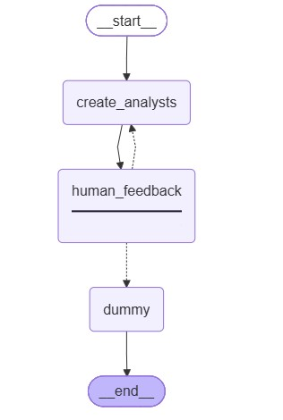
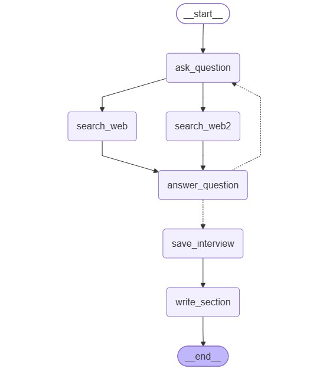
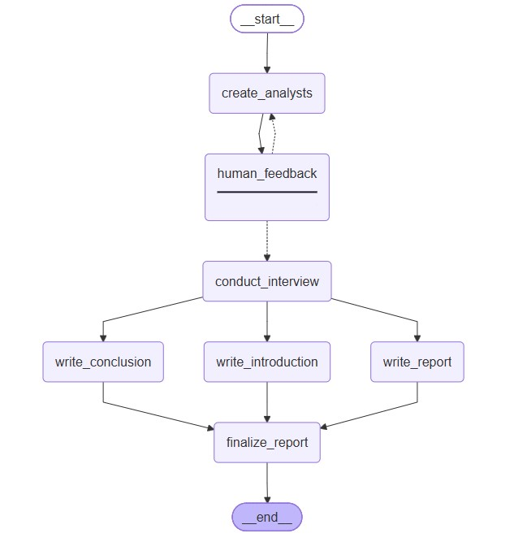

# 🔬 ResearchForge

> A multi-agent research assistant that generates expert analyst personas, runs parallel web-grounded interviews, and synthesizes everything into a cited Markdown report — powered by local LLMs via Ollama and Tavily web search.

---

## About

ResearchForge takes a research topic, generates a panel of expert analyst personas, pauses for human review, then fans out parallel interview subgraphs — each grounded in live Tavily web search. The results are synthesized into a structured Markdown report with citations, introduction, body, and conclusion.

Built entirely on open-source, local LLMs via Ollama — no OpenAI required.

---

## Tech Stack

| Layer               | Tool                     | Role                                                                      |
| ------------------- | ------------------------ | ------------------------------------------------------------------------- |
| Graph orchestration | LangGraph                | Stateful graph execution, interrupts, parallel fan-out via `Send` API   |
| LLM framework       | LangChain                | Message handling, structured output, model integration                    |
| LLM provider        | Ollama (`qwen2.5:14b`) | All LLM calls — analyst generation, interviews, report writing           |
| Web research        | Tavily                   | Live web search for retrieval-grounded answers                            |
| UI                  | Streamlit                | 4-phase interactive research UI                                           |
| Data validation     | Pydantic                 | Structured output models (`Analyst`, `Perspectives`, `SearchQuery`) |
| Runtime             | Python 3.10+             | Application runtime                                                       |
| Package management  | uv / pip                 | Dependency management                                                     |
| Config              | python-dotenv            | Loads API keys from `.env`                                              |

---

## Project Structure

```
ResearchForge/
├── streamlit_app.py              # Streamlit UI entry point
├── main.py                       # CLI runner
├── requirements.txt
├── graphs/                       # Graph diagrams
│   ├── 01_create_analysts.jpg
│   ├── 02_interview_subgraph.jpg
│   ├── 03_deep_agent.jpg
└── src/
    ├── agent.py                  # Analyst generation graph
    ├── answering_questions.py    # Interview subgraph
    ├── deep_agent.py             # Full research pipeline graph
    └── utils/
        ├── config.py             # All tunables in one place
        ├── models.py             # Ollama model instances
        ├── nodes.py              # All graph node implementations
        ├── edges.py              # Routing and fan-out logic
        ├── states.py             # TypedDict state definitions
        ├── objects.py            # Pydantic models
        ├── prompts.py            # All prompt templates
        └── tools.py              # (reserved)
```

---

## Graphs

### 1. Create Analysts Graph

Generates analyst personas and pauses for human review before research begins.



---

### 2. Interview Subgraph

Each analyst runs this subgraph independently in parallel — question, dual web search, answer, loop until max turns.



---

### 3. Deep Agent — Full Research Graph

The complete end-to-end pipeline: analyst generation → human review → parallel interviews → report assembly.



---

## Installation

### Prerequisites

| Requirement           | Notes                                                          |
| --------------------- | -------------------------------------------------------------- |
| Python 3.10+          | Required                                                       |
| Ollama                | Must be running locally                                        |
| `qwen2.5:14b` model | Pulled via Ollama                                              |
| Tavily API key        | Required for web search —[get one here](https://www.tavily.com/) |

### 1. Clone the repository

```bash
git clone --no-checkout --depth=1 --filter=blob:none https://github.com/IshaanLabs/Awesome-AI-Agents.git
cd Awesome-AI-Agents
git sparse-checkout set deep-research-agent
git checkout
cd deep-research-agent
```

### 2. Install dependencies

```bash
pip install -r requirements.txt
```

### 3. Pull the Ollama model

```bash
ollama pull qwen2.5:14b
```

---

## Configuration

All tunables live in `src/utils/config.py`:

```python
# Ollama
OLLAMA_BASE_URL    = "http://localhost:11434"
OLLAMA_MODEL       = "qwen2.5:14b"
OLLAMA_TEMPERATURE = 0

# Tavily
TAVILY_API_KEY     = "your_tavily_api_key_here"
TAVILY_MAX_RESULTS = 3

# Research defaults
DEFAULT_MAX_ANALYSTS = 3
DEFAULT_MAX_TURNS    = 2
```

No `.env` file is required — keys are managed directly in `config.py`. Do not commit real API keys to public repositories.

---

## Usage

### Streamlit UI (recommended)

```bash
# Start Ollama
ollama serve

# Launch the UI
streamlit run streamlit_app.py
```

Open `http://localhost:8501` in your browser. The UI walks you through 4 steps:

1. Enter your research topic and configure analysts/turns in the sidebar
2. Review generated analyst personas — approve or provide feedback to regenerate
3. Watch live progress as parallel interviews run
4. Read and download the final report and full conversation log

### CLI

```bash
# Basic
python main.py "Impact of RAG in enterprise support teams"

# With options
python main.py "Impact of RAG in enterprise support teams" --analysts 3 --turns 2
```

### Example Input

```json
{
  "topic": "The business impact of retrieval-augmented generation in enterprise support teams",
  "max_analysts": 3
}
```

### Example Output

The final report is a structured Markdown document containing:

- A compelling title and introduction
- Per-analyst research sections with inline citations
- A consolidated insights body
- A conclusion
- A full numbered source list with URLs

Two downloadable files are available from the UI:

- `research_report.md` — the final synthesized report
- `conversation_log.md` — the full interview transcripts from all analysts

---

## Contributing

Contributions to this project are welcome! If you have ideas for improvements, bug fixes, or new features, feel free to open an issue or submit a pull request.

---

## License

This project is licensed under the MIT License — see the [MIT License](https://opensource.org/licenses/MIT) file for details.
